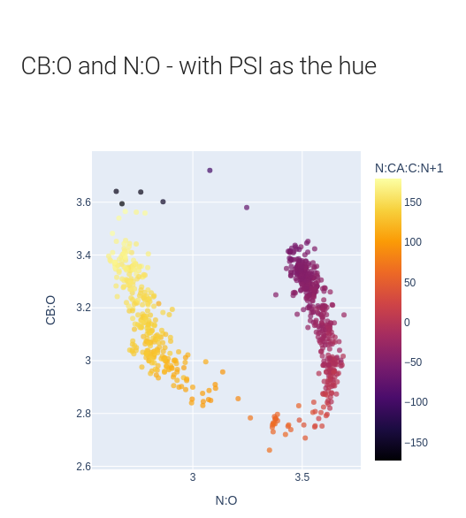

# lib-prometry

## A library to calculate geometric parameters of protein structures and perform criteria search.

```bash
pip install prometry
```
                                                      
The `prometry` library enables the discovery of correlations in protein geometry through a simple interface to calculate distances, angles and dihedrals in protein structures from cif or pdb files.  



Additionally, `prometry` has a defined geoemtric-search language. It can find distances, angles or dihedrals by describing 2,3 or 4 atoms respectively using the standard atom names for proteins.  

The 20 standard amino acids and their atoms can be [viewed here](https://www.imgt.org/IMGTeducation/Aide-memoire/_UK/aminoacids/formuleAA/).

Additionally, criteria can be described to expand or decrease the search space such as distance criteria and amino acid restrictions. 
This means the library can create dataframes for uses as diverse as contact maps, nearest neighbours, possible hydrogen bonds or a simple correlation such as the Ramachandran plot.

PyDoctor documentaion for the `prometry` interface: https://rae-gh.github.io/lib-prometry/

---                           

This application has been developed by [Rachel Alcraft](mailto:rachelalcraft@gmail.com) as an offshoot of a PhD at Birkbeck, University of London &copy; Rachel Alcraft (2023). Supervisor Dr. Mark A. Williams.
